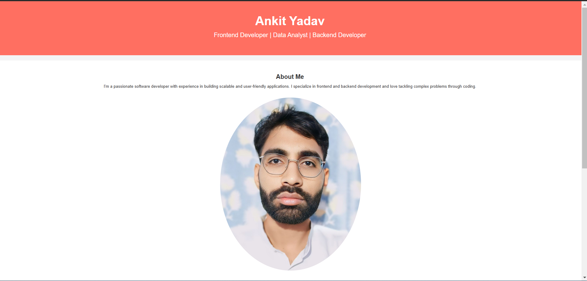
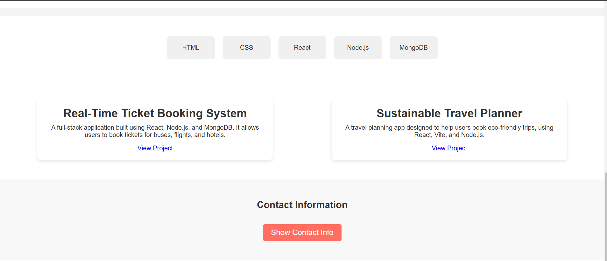

# My Portfolio Website

Welcome to my personal portfolio website! This site is built with **HTML** and **CSS** and showcases who I am, what I can do, and the projects I’ve worked on. It's a perfect place to get to know me and explore my work.

---

## Table of Contents

- [My Portfolio Website](#my-portfolio-website)
  - [Table of Contents](#table-of-contents)
  - [About the Project](#about-the-project)
  - [Installation Instructions](#installation-instructions)
  - [Usage Examples](#usage-examples)
  - [Contributing](#contributing)


---

## About the Project

This is my personal portfolio website that provides an overview of:

- **About Me**: A section where I introduce myself and my journey.
- **Skills**: A list of my skills and expertise.
- **Projects**: A showcase of my work, with links to explore them.
- **Contact**: Information on how to reach out to me.


## Installation Instructions

Here’s how you can set up this project on your own machine:

1. **Clone the Repository**:  
   First, you need to download the project files from GitHub. Open your terminal and run the following command:
   ```bash
   git clone https://github.com/<your-username>/<repository-name>.git
   ```

2. **Navigate to the Project Folder**:  
   Once the files are downloaded, navigate to the project folder using the terminal:
   ```bash
   cd <repository-name>
   ```

3. **Open the Project in Your Browser**:  
   Find the `index.html` file in the project folder and open it in any web browser. You should see your portfolio website displayed!

---

## Usage Examples

Here’s what you’ll see when you open the website:

- **Desktop View**: The site will show a clean and well-organized layout with sections for about, skills, projects, and contact.




---

## Contributing

I’d love for you to contribute and help improve this project! Here's how you can get involved:

1. **Fork the Repository**:  
   Click the “Fork” button on the top-right corner of the repository page to create a copy of the project in your GitHub account.

2. **Clone Your Fork**:  
   Clone your forked version of the repository to your local machine:
   ```bash
   git clone https://github.com/<your-username>/<repository-name>.git
   ```

3. **Make Changes**:  
   Open the project in a code editor (e.g., Visual Studio Code) and feel free to make changes. You can add new sections, improve design, or enhance features.

4. **Push Your Changes**:  
   After making changes, push them to your forked repository on GitHub.

5. **Create a Pull Request**:  
   Once you're ready, open a pull request from your fork to the main repository. I will review your changes and merge them if everything looks good.

---
